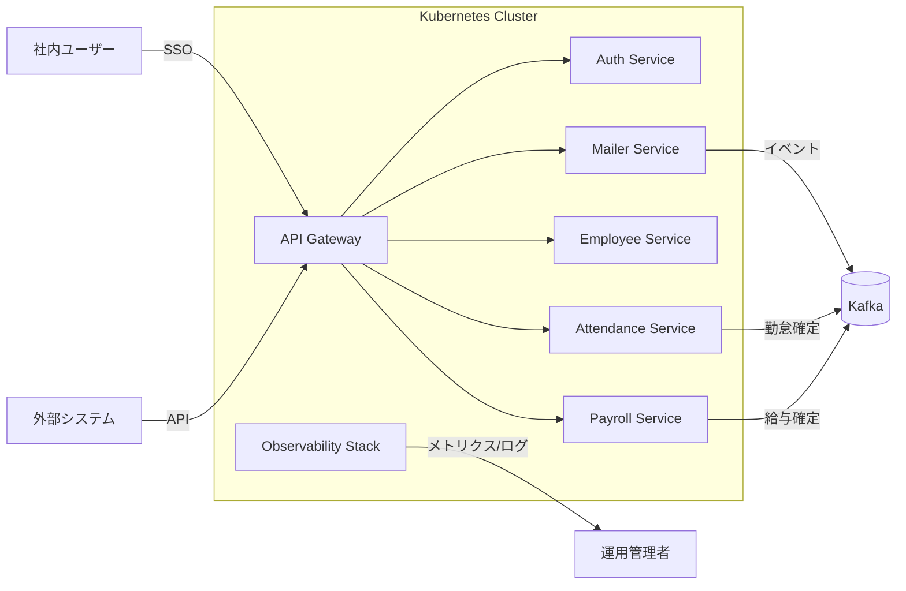
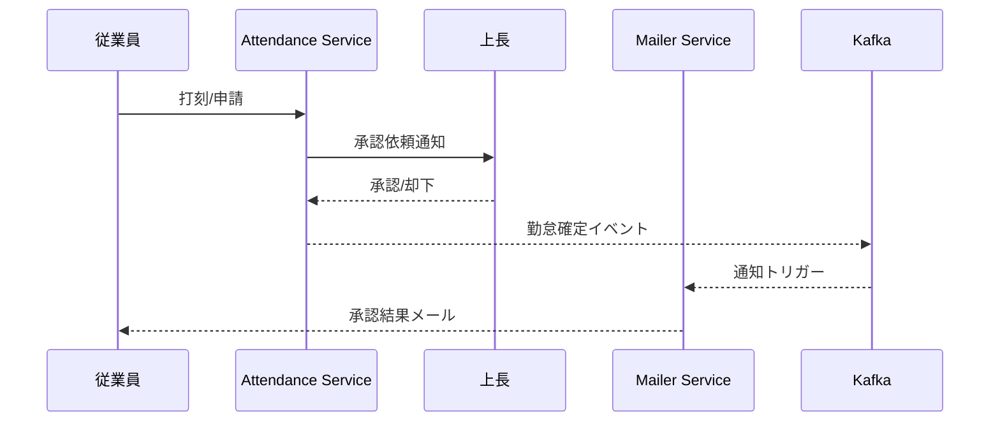

# 社内管理システム仕様書

## 1. システム概要
- 目的: 社内業務 (メール配信、社員管理、勤怠、給与) を統合的に提供するマイクロサービス群を Kubernetes 上で運用する。
- ユーザー: 社員、管理者 (人事/経理/システム管理者)、システム連携クライアント。
- 前提: 社内ネットワークまたは VPN 内からのアクセス、社内 IdP と連携したシングルサインオン。

## 2. 全体アーキテクチャ
- Kubernetes クラスタ: プロダクション/ステージング環境を分離。ネームスペース単位でサービスを分割。
- サービスメッシュ: Istio (もしくは Linkerd) を採用し、mTLS とトラフィック制御を実現。
- API ゲートウェイ: Ingress + API Gateway (Kong) を利用し、認証・レート制御・ルーティングを担う。
- メッセージング: Kafka を利用し非同期イベント連携 (通知要求、勤怠確定イベント、給与計算トリガー等) を実現。
- ストレージ: 主要データは PostgreSQL、監査・ログは Elasticsearch、オブジェクトストレージは S3 互換サービス。
- 技術スタック: TypeScript モノレポ構成 (pnpm/turbo)。フロントエンドは Next.js 16 (App Router, Server Actions)。バックエンドの各マイクロサービスは Hono + Node.js 20 上で稼働し、データアクセスは Drizzle ORM 経由で PostgreSQL を利用。

### 2.1 フロントエンドアーキテクチャ
- 社内ポータル UI を Next.js 16 で実装し、SSO 認証後に各業務機能へのリンクおよび一部の BFF (Backend for Frontend) API を提供。
- Server Actions と React Server Components を活用して、権限に応じたダッシュボード、通知センター、申請フォームを実装。
- API 呼び出しは `@/lib/apiClient` (fetch wrapper) から行い、各サービスの Hono API を JWT で呼び出す。

### 2.2 バックエンド共通実装方針
- Hono による REST/gRPC Bridge: REST エンドポイントを Hono で実装し、必要に応じて gRPC Gateway を追加。`apps/<service>-api` にサービス毎の Hono アプリを配置。
- Drizzle ORM: 各サービスでスキーマを `packages/db/src/schema/*.ts` に定義し、マイグレーションは `drizzle-kit` を用いて CI から実行。
- 共通ライブラリ: 認証ミドルウェア、エラーハンドリング、ロギングなどを `packages/core` に実装し、各サービスから再利用。

## 3. セキュリティ・共通基盤
- 認証: OAuth2/OIDC (Authorization Code + PKCE)。発行トークンは JWT。
- 認可: RBAC (ロール: `employee`, `manager`, `hr_admin`, `finance_admin`, `system_admin`)。
- シークレット管理: Vault + Kubernetes Secrets (同期)。
- ネットワーク制御: NetworkPolicy による East-West 通信制限、WAF で North-South 防御。
- CI/CD: GitHub Actions + Argo CD。イメージスキャン (Trivy)、署名 (Cosign)。
- 監視: Prometheus, Grafana, Loki, Tempo, Alertmanager。OpenTelemetry でトレース収集。

## 4. 認証サービス (Auth Service)
### 4.1 機能概要
- 社内 IdP (LDAP/AD) と同期し、ユーザー・グループ情報を管理。
- OAuth2/OIDC プロバイダーとしてトークン発行、リフレッシュ、失効を提供。
- RBAC ポリシー管理、監査ログ保存。

### 4.2 API
| メソッド | エンドポイント | 概要 |
|----------|----------------|------|
| POST     | `/oauth/token` | トークン発行 (Authorization Code 交換) |
| POST     | `/oauth/revoke`| トークン失効 |
| GET      | `/userinfo`    | ユーザー情報参照 |
| GET/POST | `/rbac/roles`  | ロール一覧/登録 |

### 4.3 非機能要件
- 可用性: 99.9% SLA、Active-Active 構成。
- 監査: すべてのトークン操作を監査ログに記録、7 年保管。
- パフォーマンス: トークン発行レイテンシ p95 < 200ms。

### 4.4 実装ノート
- Hono の `authApp` にて `/oauth/*` ルートを実装し、JWT 発行ロジックを `packages/core/auth` に集約。
- Drizzle スキーマは `packages/db/src/schema/auth.ts` に定義し、トークン失効リストや監査ログテーブルを管理。
- Next.js ポータルの BFF は `apps/portal` から `api/auth/session` でリフレッシュトークンを管理。

## 5. メーラーサービス (Mailer)
### 5.1 機能モジュール
- テンプレート管理: バージョン管理、プレビュー、マルチ言語対応。
- 配信ジョブ: メッセージキュー (Kafka) に送信要求を投入、ワーカーが SMTP Relay へ接続。
- 配信レポート: 成功/失敗統計、再送制御、通知チャンネル (Slack/Teams) 連携。

### 5.2 データモデル
- `mail_templates(id, name, version, subject, body, locale, created_by, updated_at)`
- `mail_jobs(id, template_id, payload, status, scheduled_at, sent_at)`
- `mail_history(id, job_id, recipient, status, response_code, logged_at)`

### 5.3 API
| メソッド | エンドポイント | 概要 |
|----------|----------------|------|
| GET/POST | `/templates`           | テンプレート一覧/作成 |
| PUT/DELETE | `/templates/{id}`    | 更新/削除 |
| POST     | `/send`                | メール送信要求 (テンプレート + パラメータ) |
| GET      | `/history`             | 配信履歴検索 |

### 5.4 非機能要件
- リトライ: SMTP エラー時に指数バックオフで最大 5 回リトライ。
- レート制限: 1 分あたり 1,000 通まで。
- 監査: テンプレート変更と送信要求をロギング。

### 5.5 実装ノート
- Hono の `mailerApp` で `/templates`・`/send` を実装し、キュー投入処理は `packages/core/messaging` に切り出す。
- Drizzle でテンプレート・ジョブ・履歴テーブルを `packages/db/src/schema/mailer.ts` に定義。
- Next.js からのテンプレート編集 UI は Server Actions で `/templates` API をラップし、権限チェックを Auth サービスのロールと連携。

## 6. 社員管理サービス (Employee)
### 6.1 機能モジュール
- プロフィール管理: 氏名、連絡先、雇用区分、所属部署。
- 組織管理: 組織ツリー、役職、異動履歴。
- インポート/エクスポート: CSV/Excel、API 経由のバルク処理。

### 6.2 データモデル
- `employees(id, employee_code, name, name_kana, email, hire_date, status)`
- `departments(id, name, parent_id)`
- `positions(id, title, grade)`
- `employment_history(id, employee_id, department_id, position_id, start_date, end_date)`

### 6.3 API
| メソッド | エンドポイント | 概要 |
|----------|----------------|------|
| GET/POST | `/employees`              | 社員一覧/登録 |
| GET/PUT  | `/employees/{id}`         | 詳細取得/更新 |
| POST     | `/employees/import`       | CSV/Excel インポート |
| GET      | `/departments/tree`       | 組織ツリー取得 |
| GET      | `/audit/logs`             | 監査ログ参照 |

### 6.4 非機能要件
- 個人情報保護: カラム単位の暗号化、アクセス時マスキング、アクセスログ保存。
- パフォーマンス: 検索 API p95 < 300ms。
- 可用性: 99.5% SLA。

### 6.5 実装ノート
- Hono の `employeeApp` で `/employees`・`/departments` を実装。RBAC ミドルウェアを `packages/core/rbac` から適用。
- Drizzle スキーマは `packages/db/src/schema/employee.ts` に集約し、ビューモデル用に Materialized View を利用。
- Next.js の社員検索 UI は ISR (Incremental Static Regeneration) で基本情報をキャッシュし、詳細は Server Actions で取得。

## 7. 勤怠管理サービス (Attendance)
### 7.1 機能モジュール
- 打刻管理: Web/モバイル/IC カードからの打刻受付、位置情報オプション。
- 申請ワークフロー: 休暇、残業、出張申請の承認フロー (上長 → 人事)。
- 勤務規則管理: シフト、フレックス、コアタイム設定、アラート閾値。
- 集計/レポート: 月次実績、残業時間、休暇残高を出力。API/CSV エクスポート。

### 7.2 データモデル
- `attendance_records(id, employee_id, clock_in, clock_out, location, source)`
- `leave_requests(id, employee_id, type, start_time, end_time, status, approver_id)`
- `work_rules(id, name, rule_type, parameters)`
- `monthly_summary(id, employee_id, period, total_hours, overtime_hours, leave_hours)`

### 7.3 フロー図

### 7.4 非機能要件
- SLA: 99.5%
- スケーラビリティ: 日次 2 万打刻処理、ピーク 5 分間に 1,000 リクエスト。
- 監査: 打刻修正履歴を保持、改ざん検出アラート。

### 7.5 実装ノート
- Hono の `attendanceApp` で `/clock`・`/requests`・`/summaries` ルートを実装し、Webhook で外部打刻端末と連携。
- Drizzle スキーマは `packages/db/src/schema/attendance.ts` に分割し、勤怠確定イベントは Kafka へ `packages/core/events` から配信。
- Next.js の勤怠画面は Client Components でリアルタイム打刻 UI を提供し、Server Actions で承認フローを実装。

## 8. 給与管理サービス (Payroll)
### 8.1 機能モジュール
- 給与計算エンジン: 勤怠データと社員マスタから給与・控除を算出。
- 賞与処理: 年 2 回まで設定可、個別調整ロジック。
- 年末調整: 所得控除申告フォーム入力、税額計算、法定帳票生成。
- 支払明細配信: PDF 生成、ポータル表示、通知メール送信。

### 8.2 データモデル
- `payroll_runs(id, period, status, triggered_by, executed_at)`
- `payroll_items(id, payroll_run_id, employee_id, gross_pay, deductions, net_pay)`
- `allowance_rules(id, name, calculation_formula, effective_from, effective_to)`
- `tax_records(id, employee_id, year, withholding_tax, adjustments)`

### 8.3 API
| メソッド | エンドポイント | 概要 |
|----------|----------------|------|
| POST     | `/runs`                  | 給与計算実行 |
| GET      | `/runs/{id}`             | 計算結果確認 |
| GET      | `/runs/{id}/items`       | 従業員別明細取得 |
| POST     | `/runs/{id}/approve`     | 給与確定承認 |
| GET      | `/reports/legal`         | 法定帳票出力 |

### 8.4 非機能要件
- 正確性: 税制変更に 30 日以内対応、単体テストカバレッジ 90%以上。
- パフォーマンス: 月末バッチ (5,000 名) を 60 分以内に完了。
- セキュリティ: 給与データは静止時暗号化 (TDE) + アクセス制御。

### 8.5 実装ノート
- Hono の `payrollApp` で `/runs`・`/reports` を実装し、バッチジョブは `@fastify/cron` と組み合わせてスケジューリング。
- Drizzle スキーマを `packages/db/src/schema/payroll.ts` に定義し、計算ロジックは `packages/core/payroll-engine` でモジュール化。
- Next.js では給与明細ポータルを Server Components で提供し、PDF 生成は API 経由でストレージから署名付き URL を取得。

## 9. システム統合/連携
- イベント駆動: 勤怠確定 → 給与計算トリガー、給与確定 → メール通知。
- API 利用: 社員管理 API から勤怠/給与サービスがプロフィールを取得。
- 外部連携: 会計システムへの仕訳データ出力 (SFTP/REST)、勤怠端末連携用 API。

## 10. 運用・監視
- ダッシュボード: サービス別メトリクス (レイテンシ、エラーレート、ジョブ成功率)。
- アラート: SLA 違反、メッセージキュー滞留、DB 接続数、CPU/メモリ閾値。
- ログポリシー: アプリケーションログは JSON 形式で Loki に送信、保存期間 90 日。
- バックアップ: データベースは日次フルバックアップ + 増分、S3 バージョニング。
- DR: 別リージョンにスタンバイクラスタ、RPO 30 分、RTO 4 時間。

## 11. テスト方針
- 単体テスト: 各サービスで 80% 以上のカバレッジを目標。
- 統合テスト: CI にてサービス間 API 契約テスト、Kafka イベント契約テスト。
- セキュリティテスト: 半期に 1 回ペネトレーションテスト、SAST/DAST 常時実行。
- パフォーマンステスト: 四半期ごとにピーク負荷シミュレーション。

## 12. 移行・導入計画
- フェーズ 1: 認証・社員管理・メーラーを先行導入。既存システムとデータ同期。
- フェーズ 2: 勤怠管理を移行し、給与管理は並行稼働で検証。
- フェーズ 3: 給与管理を本番移行。全サービスの SSO 統合とポータル公開。
- 教育/トレーニング: ユーザー向けマニュアル、e-learning、ヘルプデスク整備。

## 13. リスクと対策
- データプライバシーリスク: アクセス制御強化、マスキング、定期監査。
- システム複雑性: サービス契約管理、API バージョニング、ドキュメント整備。
- 法令遵守: 労基法・税法改訂モニタリング、リーガルチェック体制。
- 可用性リスク: マルチ AZ 配置、フェイルオーバーテスト。

## 14. 今後の拡張案
- BI/アナリティクス向けデータウェアハウス (BigQuery/Snowflake) 連携。
- AI チャットボットによる問い合わせ自動化。
- モバイルアプリ (iOS/Android) での勤怠・通知対応。
- 社内ポータル統合 (SSO) での統合 UI 提供。
